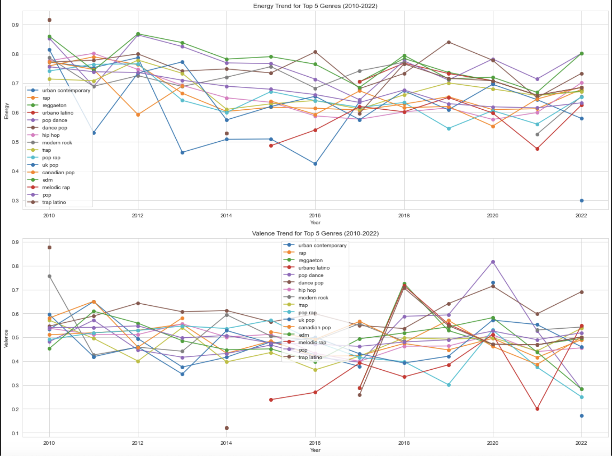
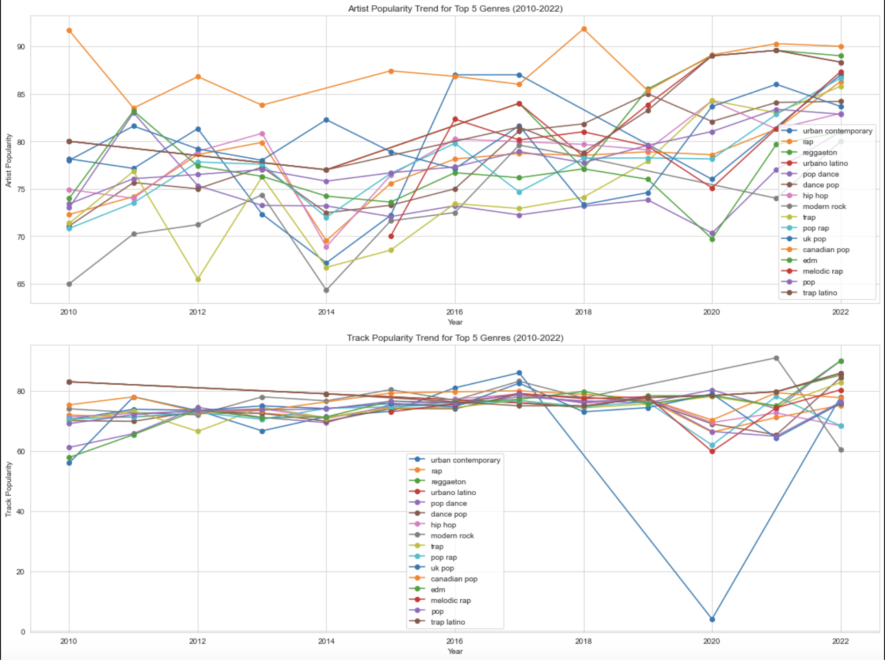
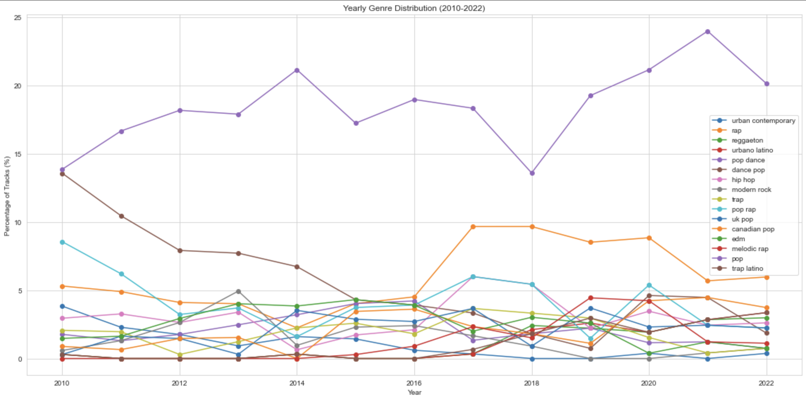

---

# 🎶 Music Genre Trends Analysis (2010-2022)

Dive deep into the heartbeats of music from 2010 to 2022. With our extensive analysis, trace the footprints of genres, feel the rhythm of their danceability, and experience the energy and emotions they convey.

  

## 📜 Table of Contents

- [Dataset Overview](#dataset-overview)
- [Key Highlights](#key-highlights)
- [Visual Extravaganza](#visual-extravaganza)
- [Conclusion](#conclusion)

## 📘 Dataset Overview

The dataset harmonizes a beautiful symphony of features:

- **Melody of Tracks and Artists**: `playlist_url`, `track_id`, `track_name`, `album`, `artist_id`, and `artist_name`.
- **Popularity Rhythms**: `track_popularity` and `artist_popularity` keep the beats.
- **Genre Vibes**: Feel the genres with `artist_genres`.
- **Audio Notes**: Revel in musical attributes from `danceability` to `valence`.

## 🌟 Key Highlights

- **Genre Footprints**: Traverse through the evolving landscapes of genres, witnessing the dominance of pop and the dynamism of rap and trap.
- **Danceability Dynamics**: Experience the pulsating danceability of different genres and how they've made the world groove.
- **Energetic Echoes & Emotional Waves**: Understand the energy and emotions resonating in tracks across the top genres.
- **Popularity Peaks**: Ascend the popularity mountains of different genres and view the world from their peaks.

## 🖼️ Visual Extravaganza

- **Genre Canvas**: A vivid line chart portraying the percentage distribution of tracks in top genres over the years.
- **Audio Artistry**: Colorful depictions of `energy` and `valence`, capturing the essence of musical attributes.
- **Stardom Stories**: Graphs narrating tales of rising and falling stardom across genres.

---

  

---

  

---

  

---

# Analysis of Musical Genres Over Time

This repository contains insights drawn from a study of various musical genres, focusing on three metrics: Energy, Valence, and Popularity (both Artist and Track). 

## Energy Analysis:

- **Pop and Dance Pop**: 
  - Fluctuating energy levels are observed.
  - A noticeable decline around 2019, suggesting a shift towards more laid-back pop tracks.

- **Rap and Trap**:
  - Exhibit rising energy levels.
  - Particularly post-2016, highlighting the energetic nature of contemporary tracks in these genres.

- **Melodic Rap**: 
  - Slight decline in energy in recent years.

## Valence Analysis (Emotional Tone):

- **Pop and Dance Pop**:
  - Initially showed higher valence scores.
  - Over time, there's a downward trend, suggesting a shift towards tracks with mixed or negative emotions.

- **Rap**:
  - Decreasing valence observed, indicating a preference for more serious or introspective themes.

- **Trap**:
  - Fluctuating valence scores observed.
  - Tends towards the lower side in recent years.

- **Melodic Rap**:
  - Valence remains fairly stable, with a slight decline in recent years.

## Artist Popularity:

- **Pop and Dance Pop**:
  - The popularity remains relatively stable with a slight increase over the years.

- **Rap, Trap, and Melodic Rap**:
  - Noticeable rise in artist popularity, especially post-2016.
  - Aligns with the global surge in the popularity of rap and its sub-genres.

## Track Popularity:

- **Pop and Dance Pop**:
  - Steady track popularity observed over the years.

- **Rap**:
  - Significant rise in track popularity post-2016.

- **Trap and Melodic Rap**:
  - Rising track popularity, especially in the latter years.

---

# 🎉 Conclusion

Over the span of a little more than a decade, the music landscape has transformed dramatically. The evolution of genres like Pop, Rap, Trap, and Melodic Rap offers a glimpse into the cultural and emotional undercurrents of the times. Pop and Dance Pop's journey through varying energy levels and emotional tones reflects the ever-changing moods of the global audience. The rise of Rap and Trap, both in terms of energy and popularity, underscores the world's desire for bold, energetic anthems.

Meanwhile, the consistent appeal of Melodic Rap hints at a delicate balance between energetic beats and heartfelt melodies. With the consistent fluctuations in track and artist popularity, it's evident that the global audience's taste is diverse, with a thirst for both novelty and nostalgia. 

The visuals and datasets presented in this repository encapsulate these changes, providing not just an analytical view but also a sonic history of the years 2010-2022. The vibrant blend of melodies, emotions, and rhythms paints a rich tapestry of the era, reminding us that music, at its core, is a reflection of humanity's soul.

---
